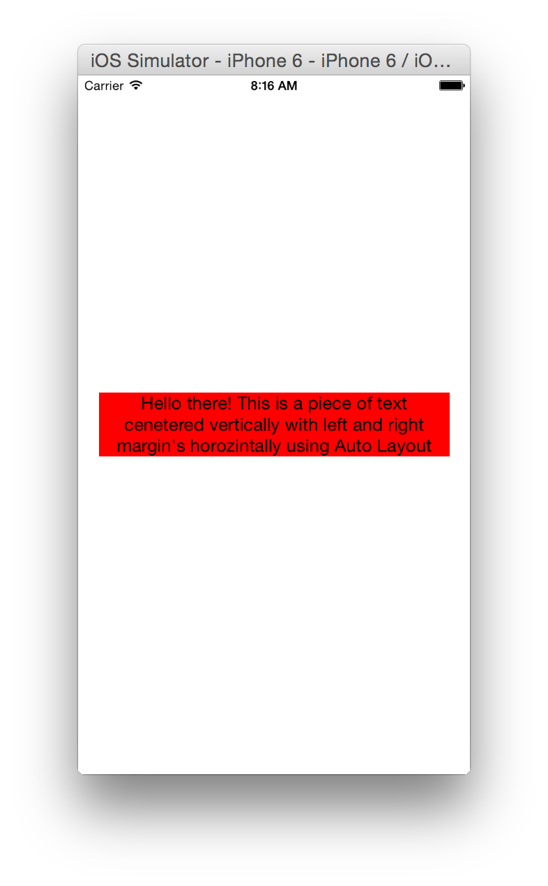

autolayout-helper-swift
=======================

A lightweight UIView extension providing helper methods for creating and adding iOS Auto Layout constraints programatically.

### Instructions
- Add the UIView+LayoutHelper.swift file to your Xcode project

### Usage

#### Adding constraints

For example to relate a label's left, right, top and bottom to its superview with some offsets

        self.titleLabel.addTopConstraint(toView: self.titleLabel.superview, attribute: .Bottom, relation: .Equal, constant: 20.0)
        self.titleLabel.addBottomConstraint(toView: self.titleLabel.superview, relation: .Equal, constant: -20.0)
        self.titleLabel.addLeftConstraint(toView: self.titleLabel.superview, relation: .Equal, constant: 10.0)
        self.titleLabel.addRightConstraint(toView: self.titleLabel.superview, relation: .Equal, constant: -10.0)

or 

<code>self.titleLabel.fillSuperView(UIEdgeInsetsZero)</code>

To center a view in both X and Y to its superview

        self.someView.addCenterXConstraint(toView: self.someView.superview, relation: .Equal, constant: 0)
        self.someView.addCenterYConstraint(toView: self.someView.superview, relation: .Equal, constant: 0)

#### Modifying constraints

Each method returns the NSLayoutConstraint object that it adds e.g. so that you can modify the constant or remove  e.g. 

      heightConstraint = self.customView.addHeightConstraint(relation: .Equal, constant: 150.0)

(where heightConstraint is a local or instance variable)

### Screenshots

### Team
* Development: [Shagun Madhikarmi](mailto:shagun@ustwo.com?subject=ustwo autolayout-helper), [Daniela Dias](mailto:daniela@ustwo.com?subject=ustwo autolayout-helper)
